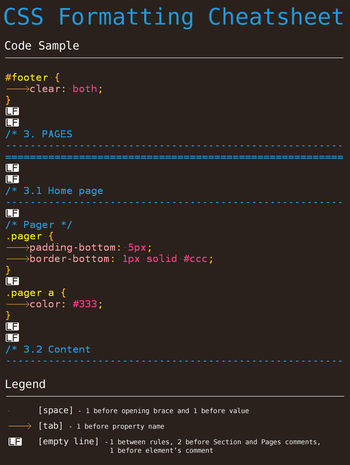

CSS Coding Standards
====================

CSS Coding Standards you must conform to when writing CSS in XHTMLized projects.

## Table of contents

- [Terminology](#terminology)
- [Write valid CSS](#write-valid-css)
- [Indentation](#indentation)
- [Line endings](#line-endings)
- [Encoding of CSS files](#encoding-of-css-files)
- [Naming conventions](#naming-conventions)
- [URLs](#urls)
- [Values](#values)
- [Fonts](#fonts)
- [Selectors](#selectors)
- [Multiple selectors](#multiple-selectors)
- [Properties](#properties)
- [Shorthand properties](#shorthand-properties)
- [Order of properties](#order-of-properties)
- [Properties with multiple values](#properties-with-multiple-values)
- [Vendor prefixed properties](#vendor-prefixed-properties)
- [Comments](#comments)
- [main.css](#maincss)
- [Page specific styles](#page-specific-styles)
- [IE styles](#ie-styles)
- [CSS formatting cheatsheet](#css-formatting-cheatsheet)
- [License](#license)

## Terminology

Concise terminology used in these standards:

```css
selector {
	property: value;
}
```

property: value makes a *declaration*. Selector and declarations makes a *rule*.

## Write valid CSS

All CSS code must be valid CSS 2.1 or CSS3.

When using vendor prefixed properties, you can ignore CSS validation errors it generates.

## Indentation

Do not use indentation for selectors.

```css
/* Correct */
.sec-nav {
}

.sec-nav li {
}

.sec-nav li a {
}

.sec-nav li a:hover {
}

/* Wrong */
.sec-nav {}

	.sec-nav li {
	}
 
		.sec-nav li a {
		}
 
			.sec-nav li a:hover {
			}
```

## Line endings

Files should be formatted with \n as the line ending (Unix line endings), not \r\n (Windows line endings) or \r (Apple OS's). 

## Encoding of CSS files

Encoding of CSS files should be set to UTF-8.

## Naming Conventions

Always use hyphens in class names. Do not use underscores or CamelCase notation.

```css
/* Correct */
.sec-nav

/* Wrong */
.sec_nav
.SecNav
```

## URLs

URLs are written without optional single quote (') or double quote ("):

```css
url(../images/logo.png)
```

## Values
Use pixels to define font sizes:

```css
font-size: 14px;
```

Always define generic font families like sans-serif or serif.

```css
/* Correct */
font-family: "ff-din-web-1", Arial, Helvetica, sans-serif;

/* Wrong */
font-family: "ff-din-web-1";
```

Shorten hexidecimal color values to 3 digits when possible:

```css
background: #fff;
```

Do not use unit with 0.

```css
/* Correct */
.nav a {
	padding: 5px 0 5px 2px;
}

/* Wrong */
.nav a {
	padding: 5px 0px 5px 2px;
}
```

Do not use default values if they are not necessary to override inherited values.
```css
/* Correct */
.nav a {
    background: url(../images/nav.png) no-repeat;
}

/* Wrong */
.nav a {
	background: transparent url(../images/nav.png) no-repeat top left;
}
```

## Fonts

Store @font-face fonts source files to `_ui/fonts` folder and fonts definitions to `1.6 Fonts` section in main.css.

## Selectors

Selectors should be on a single line, with a space after the selector, followed by an opening brace. A selector should end with a closing brace on the next line. Next selector related the the previous one should be on the next line with one additional line space between them.

```css
.nav li {
}
 
.nav a {
}
```

Avoid very complex child and descendant selectors like:

```css
/* Wrong */
.my-inbox .flyout-content .inner .message .inbox li div.take-action .actions ul li a {
}
```

## Multiple selectors

Multiple selectors should each be on a single line, with no space after each comma.

```css
.faqs a.open,
.faqs a.close {
}
```

## Properties

Every declaration should be on its own line below the opening brace. Each property should:

- have a single tab before the property name and a single space before the property value.
- end in a semi-colon.

```css
.site-name span {
    position: absolute;
    top: 0;
    left: 0;
    z-index: 10;
    background: url(../images/logo.png) no-repeat;
}
```

## Shorthand properties

Use shorthand properties when possible:

```css
.nav a {
    padding: 5px 0;
    background: url(../images/nav.png) no-repeat right bottom;
}
```

## Order of properties

Order of properties should have the following structure: box model, typography and graphic layer. The order of properties shown below is not strict but shows the how the order is structured; properties belonging to the box model goes first, typography properties goes second and graphic layer properties is added last.

```css
selector {
	display: ;
	visibility: ;
	float: ;
	clear: ;
	position: ;
	top: ;
	right: ;
	bottom: ;
	left: ;
	z-index: ;
	width: ;
	min-width: ;
	max-width: ;
	height: ;
	min-height: ;
	max-height: ;
	overflow: ;
	margin: ;
	padding: ;
	border: ;
	outline: ;
	list-style: ;
	table-layout: ;
	caption-side: ;
	border-collapse: ;
	border-spacing: ;
	empty-cells: ;
	font: ;
	font-family: ;
	font-size: ;
	line-height: ;
	font-weight: ;
	text-align: ;
	text-indent: ;
	text-transform: ;
	text-decoration: ;
	letter-spacing: ;
	word-spacing: ;
	white-space: ;
	vertical-align: ;
	cursor: ;
	content: ;
	quotes: ;
	color: ;
	background: ;
	background-color: ;
	background-image: ;
	background-repeat: ;
	background-position: ;
	opacity: ;
}
```

## Properties with multiple values

When properties can have multiple values, each value should be separated with a space.

```css	
font-family: "Lucida Grande", "Lucida Sans Unicode", Verdana, lucida, sans-serif;
```

## Vendor prefixed properties

Specify all vendor prefixed properties and use the default property last, after vendor prefixed properties:

```css
-webkit-border-radius: 5px;
-moz-border-radius: 5px;
border-radius: 5px;
```

## Comments

Follow the comments style used in main.css files (see the next section). The comments blocks should be maximum of 80 characters wide.

This comment style is used as the separator of the main sections. There are 2 empty lines before and after it:

```css
/* 1. BASE
--------------------------------------------------------------------------
========================================================================*/
```

The following comment style is used as the separator of the subsections of the main sections. It has 2 empty lines before it and 1 empty line after it:

```css
/* 2.4 Content
------------------------------------------------------------------------*/
```

This comment style is used for commenting particular page elements. It has 1 empty line before it and no empty lines after it (it is immediately followed by the rules):

```css
/* Pager */
.pager {
    padding-bottom: 5px;
    border-bottom: 1px solid #ccc;
}
```

Use upper case for the first letter in comments:

```css
/* Correct */

/* Pager */

/* Wrong */

/* pager */
```

## main.css

main.css is the main CSS file of CSS on Sails Framework. It has the following base structure:

```css
/*************************************************************************
 
  CSS on Sails Framework
  Title: Site Name
  Author: XHTMLized (http://xhtmlized.com)
  Date: March 2014
 
**************************************************************************
 
	1. BASE
		1.1 Reset
		1.2 Accessibility Navigation & Hide
		1.3 Clearfix
		1.4 Default Styles
		1.5 Image Replacement
		1.6 Fonts
	
	2. COMMON
		2.1 Container
		2.2 Header
		2.3 Navigation
		2.4 Content
		2.5 Sidebar
		2.6 Footer
	
	3. PAGES
		3.1 Home page
		3.2 Sub page 1
		3.3 Sub page 2
 
*************************************************************************/
```

- 1. BASE section resets browser styles and defines basic styling
- 2. COMMON section is for styles common to all pages or at least two pages
- 3. PAGES section defines styles for particular pages.

## Page specific styles

Define page specific styles in section 3. PAGES of main.css.

Use body class when styling needs to be limited to a particular page. When that is the case, use the following naming convention:

```css
.homepage {
}
 
.page-about {
}
 
.page-contact {
}
 
.page-news {
} 
```

## IE Styles

Use conditional classes for IE specific styles. The projects are set up with the following classes:

- .ie8 targets IE8
- .oldie targets IE8

Use IE specific rules immediately after the code you are fixing in main.css, for example:

```css
.box {
	width: 75%;
}
 
.ie8 .box {
	width: 76%;
}
```

## CSS formatting cheatsheet



## License

[](http://creativecommons.org/licenses/by/4.0/)

This work is licensed under a [Creative Commons Attribution 4.0 International License](http://creativecommons.org/licenses/by/4.0/).

